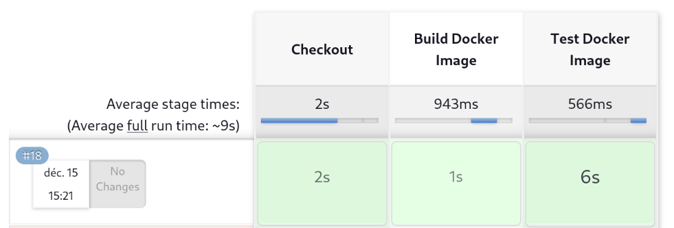

# ST2DCE-PRJ-2324S9-SE1

## Part 1: Build and Deploy an application using Docker / Kubernetes and Jenkins pipeline

1. **Diagram of the solution**


---

2. **Deployment in local by using Jenkins**

Customization of the endpoint in main.go file.

Change of the app listening port to 8081 instead of 8080 because our jenkins container already used 8080.

Dockerfile creation in accordance to the go.mod file (go version 1.21.5).

To use ssh on Jenkins, we had to change the 'Host Key Verification Strategy' to mode 'Accept first connection'.

To use ssh in the pipeline, we added credentials in Jenkins.

Our jenkins pipeline is :
```groovy
pipeline {
    agent {
        label 'jenkins-slave'
    }
    environment {
        DOCKER_IMAGE = 'webapi:1.0'
        GIT_URL = 'git@github-sophiesticode:sophiesticode/webapi-minikube.git'
    }
    stages {
        stage('Checkout') {
            steps {
                git branch: 'main', credentialsId: 'github-ssh', url: "$GIT_URL"
            }
        }
        stage('Build Docker Image') {
            steps {
                sh 'cd ./webapi/ && docker build -t $DOCKER_IMAGE -f Dockerfile .'
            }
        }
        stage('Test Docker Image') {
            steps {
                sh 'docker run -d -p 8081:8081 $DOCKER_IMAGE'
                sh 'sleep 5'
                sh 'curl localhost:8081/whoami'
            }
        }
    }
}
```

Result of the execution:



**Few precisions**:
- Connexion to jenkins-slave is necessary before. For it, a service called jenkins-slave is started when the machine starts.

jenkins-slave.service:
```bash
sophieminos@fedora:~/devops/devops-team15$ sudo systemctl cat jenkins-slave
[sudo] Mot de passe de sophieminos : 
# /etc/systemd/system/jenkins-slave.service
[Unit]
Description=Jenkins Slave Agent
After=network.target
[Service]
User=sophieminos
WorkingDirectory=/home/sophieminos/jenkins
ExecStart=java -jar agent.jar -url http://localhost:8080/ -secret ae****b7>
Restart=always
RestartSec=10
StandardOutput=journal
StandardError=journal
Environment=JAVA_HOME=/usr/lib/jvm/java-17-openjdk-17.0.13.0.11-3.fc41.x86_64
[Install]
WantedBy=multi-user.target 
```

---

3. **Deployment on our Kubernetes cluster**

Our pipeline is run by Jenkins, using deployment files acting on Kubernetes cluster.

Contrary to the previous step, our pipeline is in gitlab. Jenkins gets the Jenkinsfile (at the root of the git directory) using ssh and using the same credentials as the previous step in the pipeline.

Definition of two deployment scripts : deployments/deployment-dev.yaml and deployments/deployment-prod.yaml.

**Few precisions**:

- We need clusterip in production service for safety reasons: our prod webapi will be accessible from the inside of the cluster.
- Port forward is a blocking command, so we put it in background with `&` at the end.
- 2 namespaces: **devops-project-dev** and **devops-project-prod**

Minikube ip:


---

4. **Bonus**

Installation of pack following the documentation:
```bash
(curl -sSL "https://github.com/buildpacks/pack/releases/download/v0.36.0/pack-v0.36.0-linux.tgz" | sudo tar -C /usr/local/bin/ --no-same-owner -xzv pack)
```
We chose the `heroku/builder:24` builder because it contains a lot of languages including go with the `heroku/go@0.5.0` buildpack.

However, we had to change the go.mod file to include the repository in the path : 
`devops-team15/main`.

We can observe that the buildpack automatically detects and installs the appropriate dependencies.
However the process to build is much more longer than with a Dockerfile (the first time) because the system needs to download the buildpack. We can see that jenkins uses a cache and this time is not so long the next time: in the step **Build Docker Image**, we see 23sec for downloading and 7sec the next time by using the cache.


Moreover, it's really easy (we don't need any Dockerfile) and it's a more maintainable approach with a standard build process. However if we have very specific needs, it's better to use a Dockerfile.

## Part 2: Monitoring and Incident Management for containerized application

1. **First setps**

A namespace for it and installations:
```bash
kubectl create namespace monitoring
helm install prometheus prometheus-community/prometheus -n monitoring
helm install grafana grafana/grafana -n monitoring
```

- Port-forwarding to run **Grafana** on `3000`: 
```bash
export POD_NAME=$(kubectl get pods -n monitoring -l "app.kubernetes.io/name=grafana,app.kubernetes.io/instance=grafana" -o jsonpath="{.items[0].metadata.name}")
```
```bash
kubectl -n monitoring port-forward $POD_NAME 3000
```
=> to get the password:
```bash
kubectl get secret grafana -n monitoring -o jsonpath="{.data.admin-password}" | base64 --decode
```
- Port-forwarding to run **Prometheus alert-manager** on `9093`: 
```bash
export POD_NAME=$(kubectl get pods -n monitoring -l "app.kubernetes.io/name=alertmanager,app.kubernetes.io/instance=prometheus" -o jsonpath="{.items[0].metadata.name}")
```
```bash
kubectl -n monitoring port-forward $POD_NAME 9093
```
- Port-forwarding to run **Prometheus server** on `9090`: 
```bash
export POD_NAME=$(kubectl get pods -n monitoring -l "app.kubernetes.io/name=prometheus,app.kubernetes.io/instance=prometheus" -o jsonpath="{.items[0].metadata.name}")
```
```bash
kubectl -n monitoring port-forward $POD_NAME 9090
```

Accessing to Grafana and adding the data source (http://prometheus-server.monitoring.svc.cluster.local:80):


---
2. **Configuring alert manager**


Inspired by the list of alert on https://samber.github.io/awesome-prometheus-alerts/rules.html#kubernetes, we can define ours:
```yml
groups:
- name: kubernetes-pod-alerts
  rules:
    - alert: PodNotRunning
        expr: |
        kube_pod_status_phase{phase="Running"} == 0 and on(pod) kube_pod_status_phase{phase="Pending"} == 0
        for: 5m
        labels:
        severity: warning
        annotations:
        summary: "Pod {{ $labels.pod }} is not running for more than 5 minutes"
        description: "The pod {{ $labels.pod }} in namespace {{ $labels.namespace }} has been in a non-running state for longer than 5 minutes."
```
Our prometheus-alerts-rules.yml contains our rule.

We update the prometheus configuration with it:
```bash
helm upgrade --reuse-values -f prometheus-alerts-rules.yml prometheus -n monitoring prometheus-community/prometheus
```
A usefull tool to check prometheus files configuration is `promtool`. With it we detected errors of spelling in our yaml file.

We delete the deployment prometheus-prometheus-pushgateway:
```bash
kubectl delete deployment prometheus-prometheus-pushgateway -n monitoring
```

We can observe that the configmap has changed by checking it:
```bash
kubectl describe configmap prometheus-server -n monitoring
```


And we restart prometheus:
```bash
kubectl rollout restart deployment prometheus-server -n monitoring
```

Finally we have our alerts:

And visualizing it in the API:


---
3. **Bonus**

- New Alert

To test a new alert to send it by email, we create one which is recurrent like "when a pod is up". It is in the same group as the previous one (**kubernetes-pod-alerts**):
```yml
- alert: PodIsUp
    annotations:
    description: The pod {{ $labels.pod }} in namespace {{ $labels.namespace }} is up and running.
    summary: Pod {{ $labels.pod }} is up.
    expr: up{job="kubelet", kubernetes_namespace="default", kubernetes_pod_name=~".+"} == 1
    for: 10s 
    labels:
    severity: info
```
And we apply it the same way as the previous one.

- Emails settings

Then we create alertmanager-config.yml which contains the necessary variables for emails. We upgrade the prometheus config with it:
```bash
helm upgrade --reuse-values -f alertmanager-config.yml prometheus -n monitoring prometheus-community/prometheus
```

Then we can see that our config is applied:


## Part 3: Logs Management (Loki)

1. **First setps**

- Loki installation

We create values.yml and we install the grafana/**loki** chart with it:
```bash
helm install loki grafana/loki -f values.yml -n monitoring
```
All services in monitoring namespace:


- Loki test
Port-forward in order to test:
```bash
kubectl port-forward -n monitoring svc/loki-gateway 3100:80
```
And that works!
```bash
sophieminos@fedora:~/devops/devops-team15$ curl -H "Content-Type: application/json" -XPOST -s "http://127.0.0.1:3100/loki/api/v1/push"  \
--data-raw "{\"streams\": [{\"stream\": {\"job\": \"test\"}, \"values\": [[\"$(date +%s)000000000\", \"fizzbuzz\"]]}]}"
sophieminos@fedora:~/devops/devops-team15$ curl "http://127.0.0.1:3100/loki/api/v1/query_range" --data-urlencode 'query={job="test"}' | jq .data.result
  % Total    % Received % Xferd  Average Speed   Time    Time     Time  Current
                                 Dload  Upload   Total   Spent    Left  Speed
100  2849    0  2821  100    28  63590    631 --:--:-- --:--:-- --:--:-- 64750
[
  {
    "stream": {
      "detected_level": "unknown",
      "job": "test",
      "service_name": "test"
    },
    "values": [
      [
        "1736089057000000000",
        "fizzbuzz"
      ]
    ]
  }
]
sophieminos@fedora:~/devops/devops-team15$ 
```
- Loki integration in grafana


2. **Query**

We put the expression `{namespace="devops-project-prod"} |~ "(?i)error"` in the query code field to display all log lines containing the word 'error' for the 'devops-project-prod' namespace.

Information: It's without case sensitive to include all errors: `|~ "(?i)error"`. To have the exact word "error", it's `|= "error"`.

We test with this request:
```bash
curl -H "Content-Type: application/json" -XPOST -s "http://127.0.0.1:3100/loki/api/v1/push"  \
--data-raw "{\"streams\": [{\"stream\": {\"namespace\": \"devops-project-prod\", \"job\": \"test\"}, \"values\": [[\"$(date +%s)000000000\", \"ERROR test\"]]}]}"
```

- Verification in the terminal first:


- In grafana:

Request in grafana

and the result:

